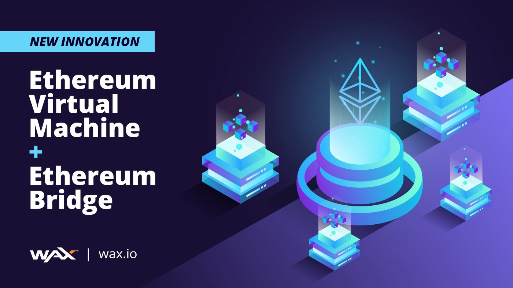

---
title: "WAX Ethereum Bridge"
description: "将您的资产从以太坊连接到 WAX"
date: 2022-08-21T00:00:00+08:00
lastmod: 2022-08-21T00:00:00+08:00
draft: false
authors: [“boogArno”]
featuredImage: "wax-ethereum-bridge.png"
tags: ["DeFi","WAX Ethereum Bridge"]
categories: ["nfts"]
nfts: ["DeFi"]
blockchain: "ETH"
website: "https://on.wax.io/wax-io/"
twitter: "https://twitter.com/WAX_io"
discord: ""
telegram: ""
github: ""
youtube: ""
twitch: ""
facebook: ""
instagram: ""
reddit: ""
medium: ""
steam: ""
gitbook: ""
googleplay: ""
appstore: ""
status: "Live"
weight: 
lightgallery: true
toc: true
pinned: false
recommend: false
recommend1: false
---
WAX 旨在成为业内最完整、气候友好的 NFT 生态系统，面向希望利用区块链力量的领先品牌、艺术家、创作者和开发人员。顶级品牌（包括 Topps、Capcom、Atari、Funko、Lionsgate 等）依靠 WAX 推出其 NFT 系列，而最多产的创作者和开发者使用 WAX 强大的工具套件来创建屡获殊荣的视频游戏和 dApp。自 2017 年成立以来，WAX 一直被称为“NFT 之王”，但不仅如此——WAX vIRL® 技术实际上是数字商务的未来。

WAX 为品牌提供成功推出 NFT 系列所需的一切——从游戏和 dApp 到交易所、数字市场等等。

