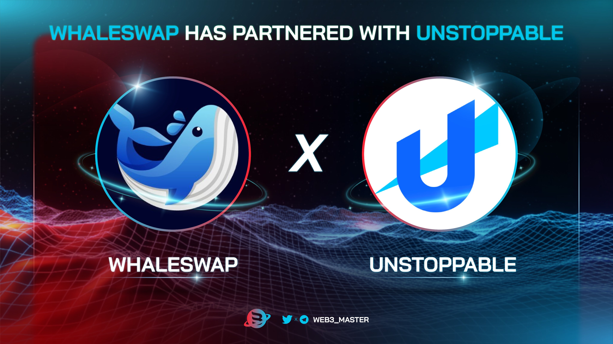

WhaleSwap 是下一代 DEX，通过其创新的混合流动性池最大限度地提高资本效率和收益。

Whaleswap 是一个无摩擦的去中心化收益再分配 Defi 智能合约。被动收入完全由持有者无所作为！持有并赚取！在币安智能链网络上。

WhaleSwap 是每个主要链的无需许可的去中心化交易所（DEX）。WhaleSwap 用户将能够使用最先进的技术交易任何代币，从而实现高速、低成本和低滑点交易。

在 WhaleSwap，我们一直在努力为我们最近发布的 DEX 准备好一切。我们一直在测试、优化、修复和规划未来。

