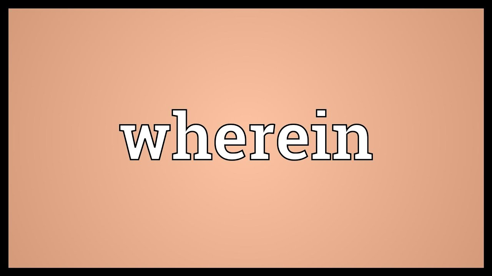

“wherein”是一个生活共享社区，每个人都在创造高质量的内容，社区因为你的存在而变得有趣。开发团队来自中国。我们之前建立了 Steem 中文社区（www.cnstm.org）。

什么是WhereIN?
Wherein是一款基于区块链技术开发的生活方式分享社区，也是作为一个奖励人们分享生活方式和视觉体验的社区。在社区里面，所有的行为（包括发帖、点赞）都将会产生直接的价值，并且所有的价值都会返还给社区。

