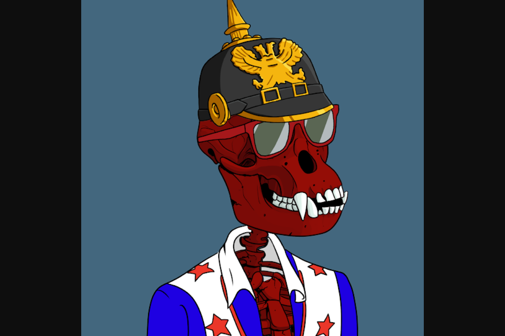

在人类成为星际物种并离开我们的太阳系很久之后，类人猿在地球上漫游，直到一颗星际彗星 Oumuamua 摧毁了所有类人猿生命。几十年来，这颗彗星的放射性效力使 10,000 只邪恶的猿类复活，它们现在将在被称为邪恶猿骨俱乐部的以太坊区块链上度过永恒的生命。0,000 只骨骼猿作为 ERC-721 不可替代代币生活在以太坊区块链上。通过拥有一只猿，您会自动获得 10 美元 WCKD 实用代币，可在整个 Wicked Bone Club 生态系统中使用。

