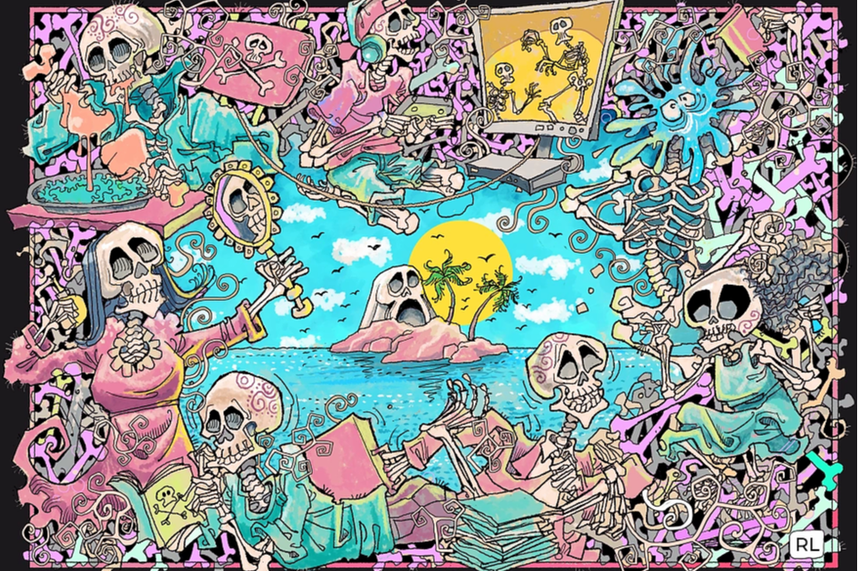

---
title: "Wicked Craniums"
description: "The Wicked Craniums 是 10,762 个独特的 Craniums NFT 的集合——生活在以太坊区块链上的独特数字收藏品。"
date: 2022-08-21T00:00:00+08:00
lastmod: 2022-08-21T00:00:00+08:00
draft: false
authors: [“boogArno”]
featuredImage: "wicked-craniums.png"
tags: ["Collectibles","Wicked Craniums"]
categories: ["nfts"]
nfts: ["Collectibles"]
blockchain: "ETH"
website: "https://www.wickedcranium.com"
twitter: "https://twitter.com/WickedCraniums"
discord: "https://discord.gg/yBYAdy8fqX"
telegram: ""
github: ""
youtube: ""
twitch: ""
facebook: ""
instagram: ""
reddit: ""
medium: ""
steam: ""
gitbook: ""
googleplay: ""
appstore: ""
status: "Live"
weight: 
lightgallery: true
toc: true
pinned: false
recommend: false
recommend1: false
---
邪恶的颅骨是属于骨岛的 10,762 个颅骨的图形表示。每一个邪恶的颅骨。它们具有 180 多个可区分的特征。所以请留意你最喜欢的头盖骨！每个头盖骨也是您进入会员唯一社交平台 The Cradle 的门票。

Wicked Craniums 是真正的 Alt NFT 项目，专注于音乐、体验和活动。代表反叛者的 The Wicked Craniums 是 2021 年初始浪潮中最糟糕的 NFT 生成集合，具有无与伦比的实用性和该领域最专注的社区之一。凭借目前的合作伙伴关系，您可以参加 50 多个现场音乐节，甚至全球更多节目，Craniums 生态系统是您访问 IRL 和 Metaverse 音乐活动的通行证。

