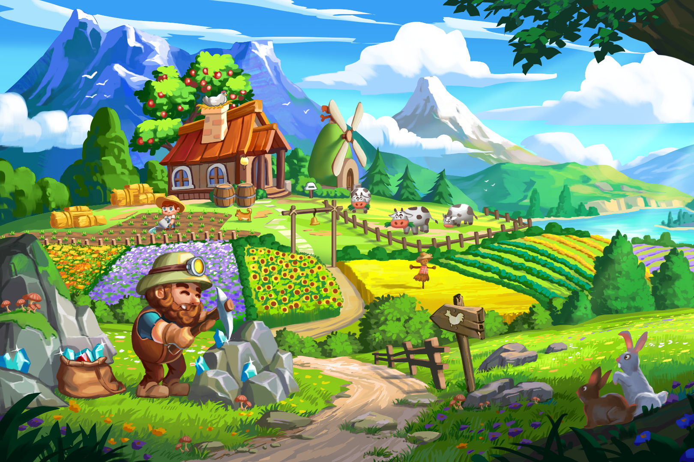

WidiLand是一款始于2021年的NFT游戏，旨在成为全球知名的社交网络游戏。
WidiLand 已经实现了许多里程碑，包括在 PancakeSwap 上市，以及在不同渠道上拥有超过 450,000 名追随者。第 1 章：旅程开始！于 2022 年 1 月发布。
故事讲述了一群精英在地球遭到严重破坏时为人类寻找新的家园：自然资源枯竭，环境污染，史前病毒的释放，杀死了地球上大多数人。他们必须搬到 WidiLand，一个像地球一样的绿蓝色卫星，并建立一个新的文明。玩家将沉浸在许多特定的角色中，享受不同的游戏模式来建造和保护他们的新家！尽早保护我们的地球是我们团队想要传达给玩家的信息。
在区块链技术的支持下，这些数字游戏内物品、土地和角色具有娱乐和经济价值。
WidiLand 致力于成为下一个去中心化和社区驱动的 GameFi。

