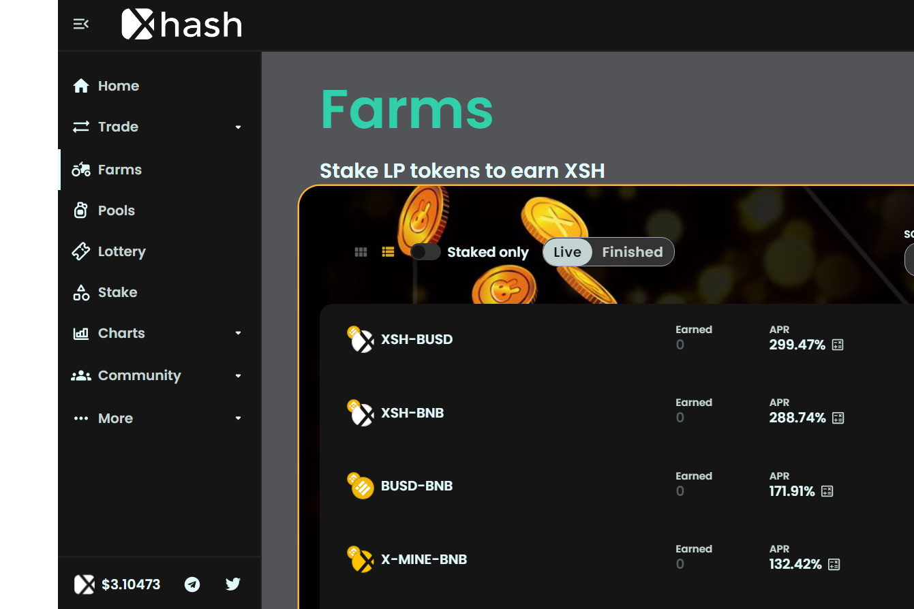

X-Hash Finance (X-HASH) 是一个农场平台，为投资者提供多个高收益池，为传统池提供了另一种选择。

Xhash 是一个面向权益、农场和矿池的 DeFi 平台，它有一个彩票系统，并将添加一个带有 nfts 的市场，可以在他们自己的矿池中使用，具有更高的 APR 和每 3 秒的收益率。
XHash 是 XMine 生态系统的一部分，是一个完整的去中心化平台，不断发展，为投资者提供更多更好的收益选择。
Xhash 拥有一个敬业且活跃的社区，CEO 扎心和努力工作，Xhash 将开发出 DeFi 可以为市场提供的最好产品。

