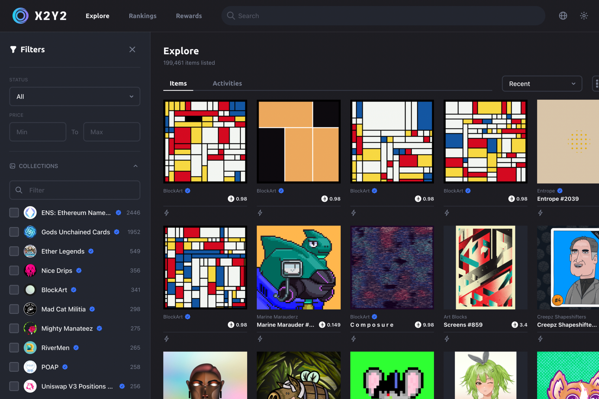

X2Y2 正在构建我们都应得的去中心化 NFT 市场：就像 LooksRare，但透明和诚实。像 OpenSea，但具有我们一直在等待的功能👇

  买卖的即时推送通知
  合并 $WETH 和 $ETH 交易
  批量发送、列表和购买
  收藏和特质优惠
  0 私下销售费用
  稀有工具
  即将到来的社区 NFT 收藏

如果这还不够，X2Y2 交易费设置为 2% 并直接进入 $X2Y2 质押池🏦

  没有洗牌交易，只有 Staking 奖励
  没有阴暗的私人销售
  公平的代币经济学

