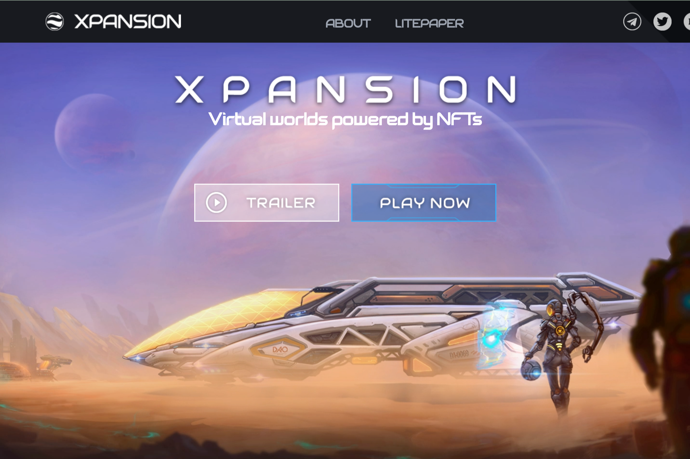

Xpansion 是一款以近期为背景的去中心化 4x 策略游戏。面对一个垂死的世界，地球上的残余人口已经发起了探险浪潮，以定居在附近恒星周围的宜居世界。

这个新的开始会让利他主义最终战胜贪婪吗？

土地资产管理和土地开发

建立你的经济基础，扩大你的政治影响力，建立联盟，积累资源。

成为最早定居开普勒 22b 的人之一。水泥开普勒 22b 作为人类在比邻星和巴纳德星登陆前的新摇篮。

积累启动新方舟以定居新世界所需的巨大资源。

