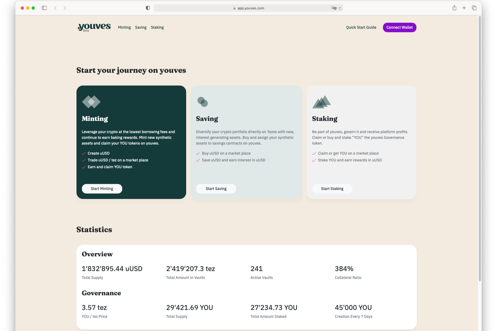

借，赚取或交换你的。
以低借贷利率借入您的加密货币并继续获得烘焙奖励。选择您的贷款面额并创建新的合成资产，如 uUSD 或 uBTC。
通过链上产生收益的资产赚取收益。将您的资产锁定在您的资金池中并赚取利息或平台收入。
以低成本交换高度相关的资产对。提供流动性，通过掉期费和收益耕作创造被动收入。

youves 是一个去中心化、非托管和自治的平台，用于创建和管理合成资产。合成资产的铸币者通过 YOU（youves 的治理代币）赚取被动收入。

YOU 代币被授予启动 youves 平台的 youves 铸币者、流动性提供者和 ubinetic。Youves 是一个分散的自治组织 (DAO)，由许多拥有投票权的 YOU 持有者管理，以管理 youves 平台的发展。您可能会被质押在一个救助基金中，以对平台进行风险管理并获得您的质押奖励作为补偿。

