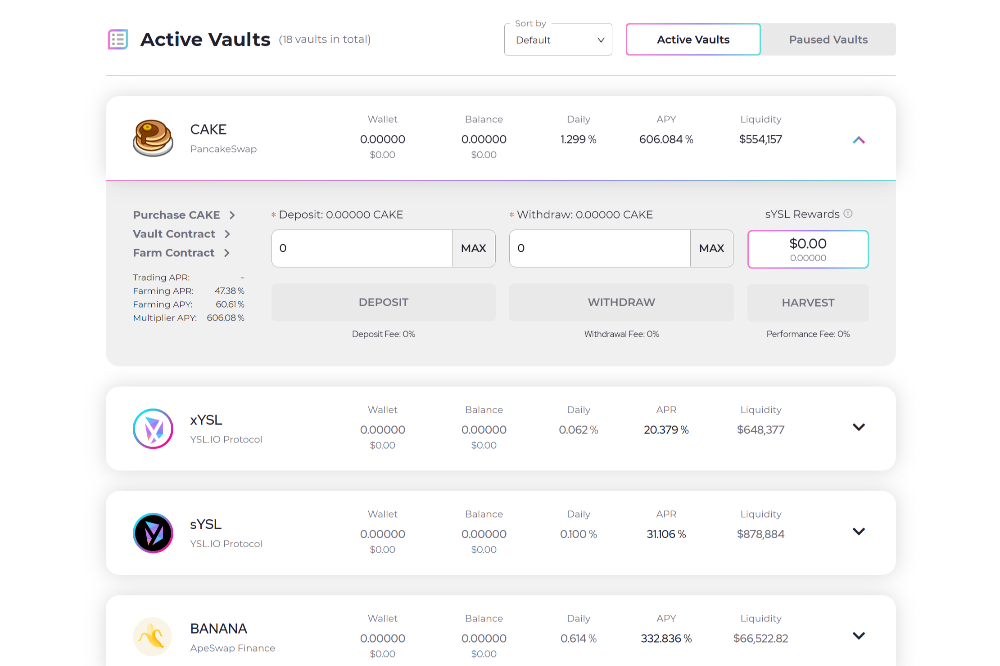

---
title: "YSL.IO"
description: "YSL.IO 旨在优化和扩大收益农业平台的回报，同时最大化锁定流动性的好处。"
date: 2022-08-20T00:00:00+08:00
lastmod: 2022-08-20T00:00:00+08:00
draft: false
authors: [“boogArno”]
featuredImage: "ysl-io.png"
tags: ["DeFi","YSL.IO"]
categories: ["nfts"]
nfts: ["DeFi"]
blockchain: "BSC"
website: "https://ysl.io/swap"
twitter: "https://twitter.com/ysl_io"
discord: ""
telegram: "https://t.me/yslen_ann"
github: "https://github.com/ysl-io"
youtube: ""
twitch: ""
facebook: "https://www.facebook.com/ysl.i0"
instagram: ""
reddit: "https://reddit.com/r/ysl_io/"
medium: "https://medium.com/ysl-io"
steam: ""
gitbook: ""
googleplay: ""
appstore: ""
status: "Live"
weight: 
lightgallery: true
toc: true
pinned: false
recommend: false
recommend1: false
---
YSL.IO 是一种尖端的 DeFi 工具，旨在优化和放大收益农业平台的回报，同时最大限度地发挥锁定流动性的好处，以创造一个真正无与伦比的代币经济。我们还有一个完全独特的代币经济学模型，我们的原生治理代币 (sYSL) 的价格与 ApeSwap 上持有的锁定流动性挂钩！换句话说;随着 YSL.IO 平台的 TVL 随着用户的增加而增加，该协议将通过创建 YSL（实用代币）来创造更多的锁定流动性，这导致 sYSL 代币的价格上涨！更重要的是，该协议产生的所有流动性将被锁定在锁定的流动性合约（ApeSwap Finance）中，期限为 1000 年！

