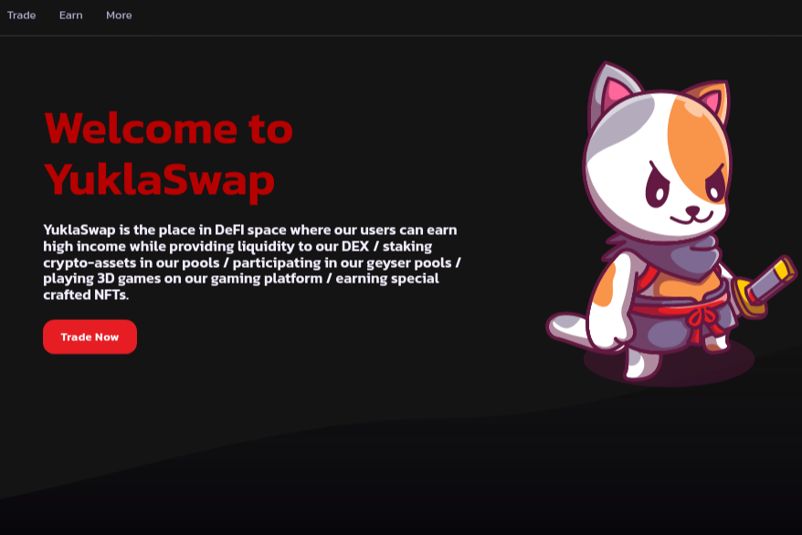

YuklaSwap 是 DeFI 空间中的一个地方，我们的用户可以赚取高收入，同时为我们的 DEX 提供流动性/在我们的池中质押加密资产/参与我们的间歇泉池/在我们的游戏平台上玩 3D 游戏/赚取特制的 NFT。
在 YuklaSwap，我们相信币安智能链和 Polygon 或 Solana 等其他链的未来有机增长。这就是为什么我们的主要目标是通过扩大我们的池、合作伙伴关系并将社区决定的链整合到我们的生态系统中，为我们的用户提供这种增长带来的所有好处。
对于那些无聊的人，在我们的游泳池和农场获得被动收入的同时，我们将带来一堆游戏，用户的技能将决定赢家而不是运气，就像彩票游戏一样。第一款游戏将是 Unity 3D 第一人称射击游戏，例如《堡垒之夜》，用户必须将其他玩家与 NPC 区分开来才能获胜。成功的玩家将获得特制的 NFT 并收取游戏费用。

