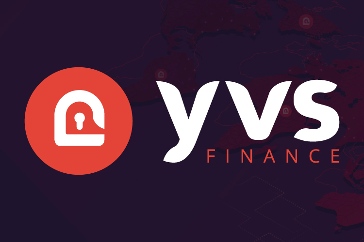

YVS 是一个创新的去中心化金融项目，它结合了创建真正独特、透明和安全的收益农业平台的最佳功能。由于智能合约是完全预编程的，投资者可以放心地将他们的存款存入我们的项目。
所有代币，从预售到最后分发的代币，都编码在合约中，不能再更改。一切都由顶级区块链安全公司 Hacken 审计，对合约没有管理员控制，也没有暴露可能导致漏洞利用的功能。
我们生活在以太坊和币安智能链上，为所有风险偏好的投资者提供质押和耕种机会以及单一资产质押池（所谓的金库）。

