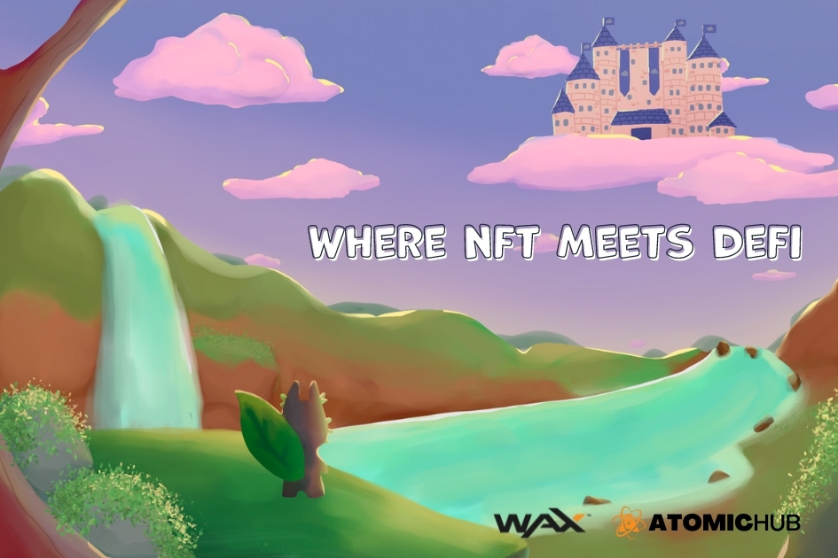

---
title: "Zendodo Party"
description: "NFT 遇到 Defi 的区块链游戏"
date: 2022-08-20T00:00:00+08:00
lastmod: 2022-08-20T00:00:00+08:00
draft: false
authors: [“boogArno”]
featuredImage: "zendodo-party.png"
tags: ["NFT Games","Zendodo Party"]
categories: ["nfts"]
nfts: ["NFT Games"]
blockchain: "WAX"
website: "https://zendodo.io/"
twitter: "https://twitter.com/ZendodoParty"
discord: "https://discord.gg/ywSuMS8QtC"
telegram: "https://t.me/zendodoparty_a"
github: ""
youtube: "https://www.youtube.com/channel/UCk7Pr2D_TdpSdRwKJZvbjXw"
twitch: ""
facebook: "https://www.facebook.com/ZendodoParty"
instagram: ""
reddit: "https://www.reddit.com/r/zendodoparty/"
medium: "https://zendodoparty.medium.com/"
steam: ""
gitbook: ""
googleplay: ""
appstore: ""
status: "Live"
weight: 
lightgallery: true
toc: true
pinned: false
recommend: false
recommend1: false
---
Zendodo 派对 (https://zendodo.io) 是 WAX 区块链上的游戏/NFT-fi，让英雄有机会将 Zendodos 聚集到他们的派对中，同时获得丰厚的回报。 Zendodos 是我们在 Dodoland 中的可爱小动物，随着英雄的进化和变形，它们会变得更加强大，并且英雄能够通过参与我们的奖励池和每周奖励来获得奖励！我们有未来的游戏玩法，例如 Mission Crafts 和 Faction Wars，我们迫不及待地想要开始这些发展。

Zendodo Party 确保玩家是 NFT 生态系统的中心。
因此，当玩家勇敢地组建自己的队伍时，他们也有权获得奖励。

