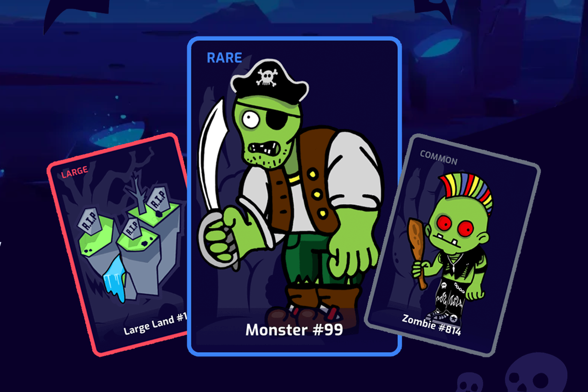

ZomLand 是一款交互式 NFT 和 Play-to-Earn 收藏游戏，具有令人兴奋的游戏玩法和很多乐趣。你扮演僵尸和怪物军队的领袖角色，与世界各地的其他用户战斗并实现你的目标。

  游戏的逻辑从土地开始。每个土地都可以产生一个僵尸。您可以每天铸造僵尸（僵尸的数量取决于土地的类型）。
  您可以使用您的土地每 24 小时索取一次僵尸。
  Monster 是一个非常强大的僵尸，具有以下附加功能：

- 在市场上出售

- 转移给另一个玩家。

- 销毁获得ZML Token。

- 可以参加土地探索（您可能会在那里找到有价值的物品或遇到怪物猎人）。

- 参加战斗竞技场。

- 增加 Staking 的盈利能力。

- 在我们的下一场比赛中获得空投奖金和白名单（基于怪物卡稀有度）。

  